Project in the works, check back soon for updates....

<h1 align="center">Leafflection</h1>

<div align="center">

</div>

---

# Computer Vision

## Introduction

Computer vision tasks include methods for acquiring,
processing, analyzing and understanding digital images,
and extraction of high-dimensional data from the real world
to produce numerical or symbolic information,
e.g., in the forms of decisions.

Understanding in this context means the transformation of visual images
(the input of the retina)
into descriptions of the world that make sense to thought processes and can
elicit appropriate action.
This image understanding can be seen as the disentangling of
symbolic information from image data
using models constructed with the aid of geometry,
physics, statistics, and learning theory.

### Computer Vision tasks include:

- **Data Analysis:** Analysis of images and understanding the content.
- **Data Augmentation:** Increase the size of the dataset by applying
  augmentation techniques.
- **Data Transformation:** Transform the data into images that highlight the
  features.
- **Model Building:** Build a model that can classify the images.
- **Model Evaluation:** Evaluate the model's performance on validation dataset.
- **Image Prediction:** Predict the class of the image using the trained model.

-------------------

## Libraries Used

- **[Tensorflow](https://tensorflow.org/guide/):** An open-source machine
  learning framework.
- **[Keras](https://keras.io/):** A high-level neural networks API.
- **[PlantCV](https://plantcv.readthedocs.io/en/stable/):** An open-source
  image analysis software package targeted for plant phenotyping.
- **Numpy:** A library for numerical computing.
- **Matplotlib:** A plotting library for the Python programming language.
- **Pandas:** A data manipulation and analysis library.
- **OpenCv:** A library of programming functions mainly aimed at real-time
  computer vision.

-------------------

## Part 1: Analysis of the Data Set

<div align="center">
  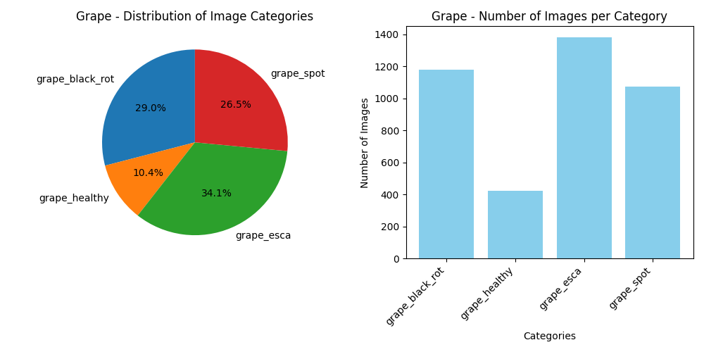
  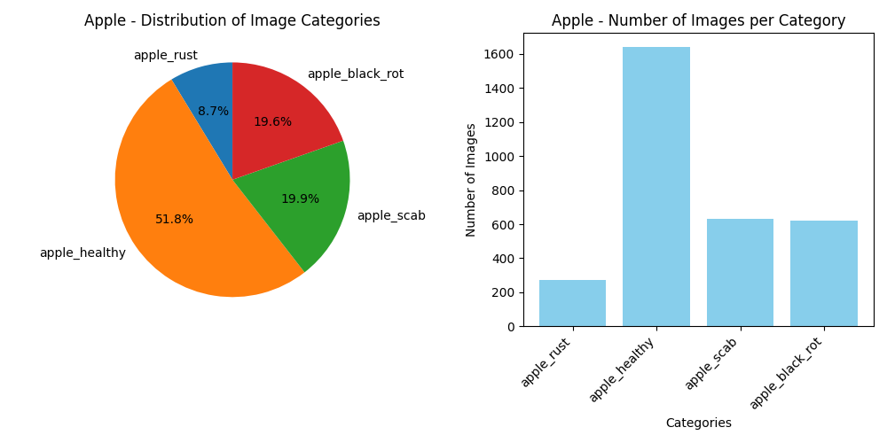
</div>

### Instructions

Write a program named `distribution.py`
that takes as arguments a directory and
fetches images in its subdirectories.
This program, and therefore you, must then extract
and analyze/understand the data
set from the images.
The program should output pie charts and bar
charts for each plant type.
Your program must also retrieve the name of the directory
to name the chart’s colones accordingly.

### Example

```bash
python3 distribution.py --src leaves/
````

The program will walk through the directories and find the root directory.
It will then extract the subdirectory names and the images in them.
To analyze the data set, the program will output pie charts and bar charts
for each plant type.

-------------------

## Part 2: Data augmentation

Looking and the data set, you will notice that the images are not enough to
train a model. The data is not balanced, which could lead to overfitting.
To solve this problem, you will need to augment the data set. This is where
`augmentation.py` comes in. This program takes in a directory and applies
augmentation techniques to the images in the directory.

It automatically
detects the directory with the most images and augments the images in the
other directories to match the number of images in the directory with the most
images. Additionally, you can specify the number of images you want to augment.

<div align="center">
    <!-- First Row -->
    <div style="display: inline-block; text-align: center; width: 20%;">
        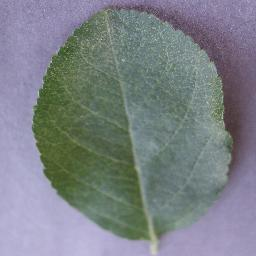
        <div>Original</div>
    </div>
</div>

<p align="center">
    <figure style="display:inline-block;">
        
        <figcaption>Affine</figcaption>
    </figure>
    <figure style="display:inline-block;">
        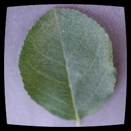
        <figcaption>Barrel</figcaption>
    </figure>
    <figure style="display:inline-block;">
        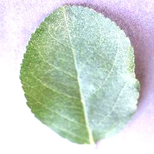
        <figcaption>Contrast</figcaption>
    </figure>
    <figure style="display:inline-block;">
        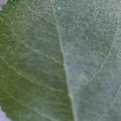
        <figcaption>Crop</figcaption>
    </figure>
    <figure style="display:inline-block;">
        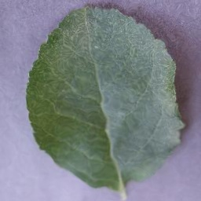
        <figcaption>Distortion</figcaption>
    </figure>
    <figure style="display:inline-block;">
        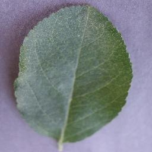
        <figcaption>Flip</figcaption>
    </figure>
    <figure style="display:inline-block;">
        
        <figcaption>Jitter</figcaption>
    </figure>
</p>

-------------------

<div align="center">
    <!-- Second Row -->
    <div style="display: inline-block; text-align: center; width: 13%;">
        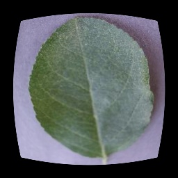
        <div>Mustache</div>
    </div>
    <div style="display: inline-block; text-align: center; width: 13%;">
        
        <div>Noise</div>
    </div>
    <div style="display: inline-block; text-align: center; width: 13%;">
        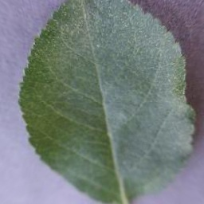
        <div>Pincushion</div>
    </div>
    <div style="display: inline-block; text-align: center; width: 13%;">
        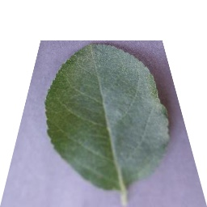
        <div>Projective</div>
    </div>
    <div style="display: inline-block; text-align: center; width: 13%;">
        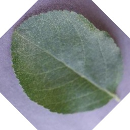
        <div>Rotate</div>
    </div>
    <div style="display: inline-block; text-align: center; width: 13%;">
        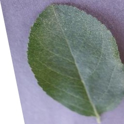
        <div>Shear</div>
    </div>
    <div style="display: inline-block; text-align: center; width: 13%;">
        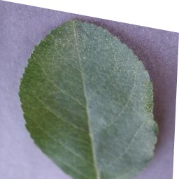
        <div>Skew</div>
    </div>
</div>

Above, you can see an example of an image going through different augmentation
techniques. The original image is top and center, and below are the augmented
versions of the image.

```bash
python3 augmentation.py --src leaves/
```

After balancing the data set, we check out the distribution of the data set
again. The data set is now balanced, and we can proceed to the next step.

<div align="center">
  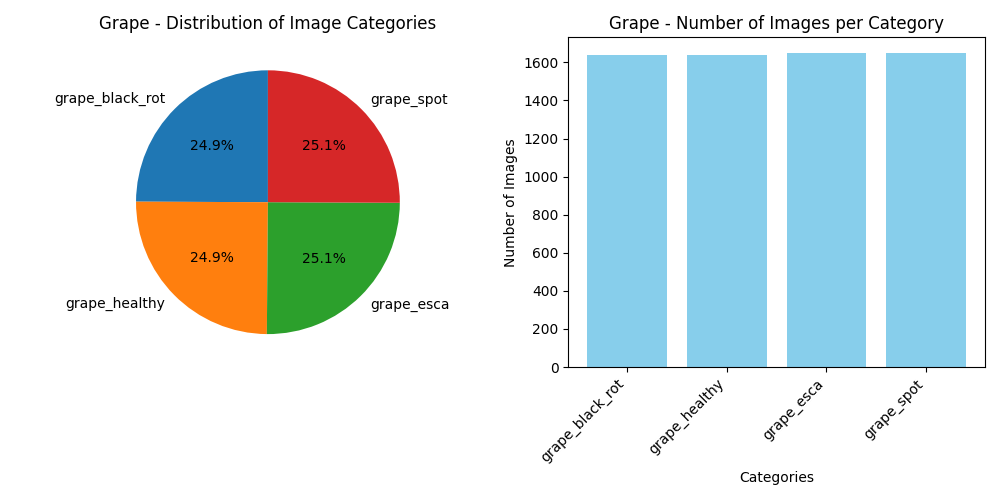
  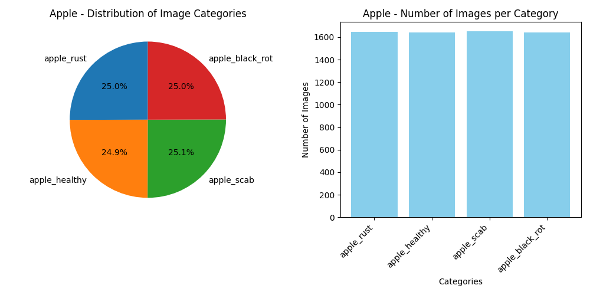
</div>


-------------------

## Part 3: Image Transformation

Next, we want to better understand the images in the data set. To achieve
this, we will transform the images to highlight the features in the images.

<div align="center">
    <div style="display: inline-block; text-align: center; width: 13%;">
        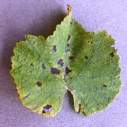
        <div>Original</div>
    </div>
    <div style="display: inline-block; text-align: center; width: 13%;">
        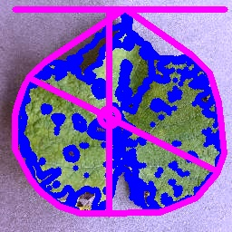
        <div>Analyze Object</div>
    </div>
    <div style="display: inline-block; text-align: center; width: 13%;">
        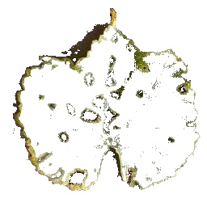
        <div>Mask</div>
    </div>
    <div style="display: inline-block; text-align: center; width: 13%;">
        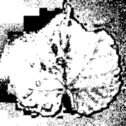
        <div>Gaussian Blur</div>
    </div>
    <div style="display: inline-block; text-align: center; width: 13%;">
        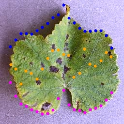
        <div>Pseudolandmarks</div>
    </div>
    <div style="display: inline-block; text-align: center; width: 13%;">
        
        <div>Roi Ojbects</div>
    </div>
</div>

<div align="center">
    <div style="display: inline-block; text-align: center; width: 13%;">
        <div align="center">
            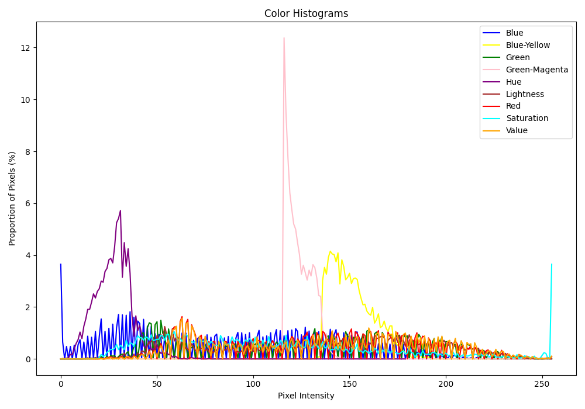
        <div>Color Histogram</div>
        </div>
    </div>  
</div>


-------------------

To run Tensorflow on docker with GPU support, use the following command:

```bash
docker run -it --rm --runtime=nvidia tensorflow/tensorflow:latest-gpu python
```

To run Tensorflow on docker with CPU support, use the following command:

```bash
docker run -it tensorflow/tensorflow bash
```

### Model Architecture Overview

```bash
Model: "sequential"
┏━━━━━━━━━━━━━━━━━━━━━━━━━━━━━━━━━━━━━━┳━━━━━━━━━━━━━━━━━━━━━━━━━━━━━┳━━━━━━━━━━━━━━━━━┓
┃ Layer (type)                         ┃ Output Shape                ┃         Param # ┃
┡━━━━━━━━━━━━━━━━━━━━━━━━━━━━━━━━━━━━━━╇━━━━━━━━━━━━━━━━━━━━━━━━━━━━━╇━━━━━━━━━━━━━━━━━┩
│ rescaling (Rescaling)                │ (None, 256, 256, 3)         │               0 │
├──────────────────────────────────────┼─────────────────────────────┼─────────────────┤
│ conv2d (Conv2D)                      │ (None, 256, 256, 16)        │             448 │
├──────────────────────────────────────┼─────────────────────────────┼─────────────────┤
│ max_pooling2d (MaxPooling2D)         │ (None, 128, 128, 16)        │               0 │
├──────────────────────────────────────┼─────────────────────────────┼─────────────────┤
│ conv2d_1 (Conv2D)                    │ (None, 128, 128, 32)        │           4,640 │
├──────────────────────────────────────┼─────────────────────────────┼─────────────────┤
│ max_pooling2d_1 (MaxPooling2D)       │ (None, 64, 64, 32)          │               0 │
├──────────────────────────────────────┼─────────────────────────────┼─────────────────┤
│ conv2d_2 (Conv2D)                    │ (None, 64, 64, 64)          │          18,496 │
├──────────────────────────────────────┼─────────────────────────────┼─────────────────┤
│ max_pooling2d_2 (MaxPooling2D)       │ (None, 32, 32, 64)          │               0 │
├──────────────────────────────────────┼─────────────────────────────┼─────────────────┤
│ conv2d_3 (Conv2D)                    │ (None, 32, 32, 128)         │          73,856 │
├──────────────────────────────────────┼─────────────────────────────┼─────────────────┤
│ max_pooling2d_3 (MaxPooling2D)       │ (None, 16, 16, 128)         │               0 │
├──────────────────────────────────────┼─────────────────────────────┼─────────────────┤
│ flatten (Flatten)                    │ (None, 32768)               │               0 │
├──────────────────────────────────────┼─────────────────────────────┼─────────────────┤
│ dense (Dense)                        │ (None, 128)                 │       4,194,432 │
├──────────────────────────────────────┼─────────────────────────────┼─────────────────┤
│ dropout (Dropout)                    │ (None, 128)                 │               0 │
├──────────────────────────────────────┼─────────────────────────────┼─────────────────┤
│ dense_1 (Dense)                      │ (None, 8)                   │           1,032 │
└──────────────────────────────────────┴─────────────────────────────┴─────────────────┘
 Total params: 12,878,714 (49.13 MB)
 Trainable params: 4,292,904 (16.38 MB)
 Non-trainable params: 0 (0.00 B)
 Optimizer params: 8,585,810 (32.75 MB)

```

This document provides an overview of the architecture of a convolutional
neural network (CNN) model designed for image classification.
Each layer of the model is explained in terms of its purpose,
output shape, and the number of parameters (`Param #`) it utilizes.

#### Layer-by-Layer Explanation

#### 1. Rescaling Layer (`rescaling`)

- **Purpose**: Normalize pixel values of input images to the range [0, 1].
- **Output Shape**: `(None, 256, 256, 3)`
- **Param #**: `0`
    - No trainable parameters; it's a preprocessing step.

#### 2. Convolutional Layer (`conv2d`)

- **Purpose**: Apply convolution operation with 16 filters.
- **Output Shape**: `(None, 253, 253, 16)`
- **Param #**: `784`
    - **Explanation**:
        - **Convolution**: This layer convolves (slides) 16 filters (small
          matrices) across the input image to produce 16 feature maps.
        - **Kernel Size**: The size of each filter matrix is `4x4`
          pixels (`kernel_size=4`), which determines the local input region to
          which each filter is applied.
        - **Activation Function (ReLU)**: Applies the ReLU (Rectified Linear
          Unit) activation function element-wise to introduce non-linearity.

#### 3. MaxPooling2D Layer (`max_pooling2d`)

- **Purpose**: Downsample representation by extracting maximum values.
- **Output Shape**: `(None, 126, 126, 16)`
- **Param #**: `0`
    - **Explanation**:
        - **Max Pooling**: Reduces the dimensionality of each feature map,
          retaining the most important information.
        - **Pool Size**: Defaults to a `2x2` window (`pool_size=(2, 2)`),
          halving the spatial dimensions (width and height).

#### 4. Convolutional Layer (`conv2d_1`)

- **Purpose**: Apply convolution operation with 32 filters.
- **Output Shape**: `(None, 123, 123, 32)`
- **Param #**: `8,224`
    - **Explanation**:
        - Builds upon the previous convolutional layer, extracting 32 different
          features.

#### 5. MaxPooling2D Layer (`max_pooling2d_1`)

- **Purpose**: Downsample representation.
- **Output Shape**: `(None, 61, 61, 32)`
- **Param #**: `0`

#### 6. Dropout Layer (`dropout`)

- **Purpose**: Regularization to prevent overfitting by randomly setting a
  fraction of input units to zero.
- **Output Shape**: `(None, 61, 61, 32)`
- **Param #**: `0`

#### 7. Convolutional Layer (`conv2d_2`)

- **Purpose**: Apply convolution operation with 64 filters.
- **Output Shape**: `(None, 58, 58, 64)`
- **Param #**: `32,832`

#### 8. MaxPooling2D Layer (`max_pooling2d_2`)

- **Purpose**: Further downsample representation.
- **Output Shape**: `(None, 29, 29, 64)`
- **Param #**: `0`

#### 9. Dropout Layer (`dropout_1`)

- **Purpose**: Regularization to prevent overfitting.
- **Output Shape**: `(None, 29, 29, 64)`
- **Param #**: `0`

#### 10. Convolutional Layer (`conv2d_3`)

- **Purpose**: Apply convolution operation with 128 filters.
- **Output Shape**: `(None, 26, 26, 128)`
- **Param #**: `131,200`

#### 11. MaxPooling2D Layer (`max_pooling2d_3`)

- **Purpose**: Further downsample representation.
- **Output Shape**: `(None, 13, 13, 128)`
- **Param #**: `0`

#### 12. Flatten Layer (`flatten`)

- **Purpose**: Convert 2D matrix into a vector.
- **Output Shape**: `(None, 21632)`
- **Param #**: `0`

#### 13. Dense Layer (`dense`)

- **Purpose**: Fully connected layer with 128 neurons.
- **Output Shape**: `(None, 128)`
- **Param #**: `2,769,024`

#### 14. Dense Layer (`dense_1`)

- **Purpose**: Output layer with 8 neurons (equal to the number of classes).
- **Output Shape**: `(None, 8)`
- **Param #**: `1,032`

---

## Summary

This CNN model uses a series of convolutional and pooling layers followed by
fully connected layers for image classification. Here's a breakdown of key
terms:

- **Convolutional Layer**: Applies filters to input images to extract features
  like edges and textures.
- **Max Pooling**: Reduces the spatial dimensions of each feature map, focusing
  on the most important features.
- **Kernel Size**: Specifies the size of the filter matrix used in
  convolutional layers.
- **Dropout**: Randomly drops a fraction of connections between layers during
  training to prevent overfitting.
- **Activation Function (ReLU)**: Introduces non-linearity to the model,
  allowing it to learn complex patterns in the data.

Understanding these components helps in designing effective neural networks for
tasks like image classification, improving both model accuracy and efficiency.
