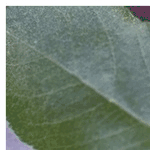
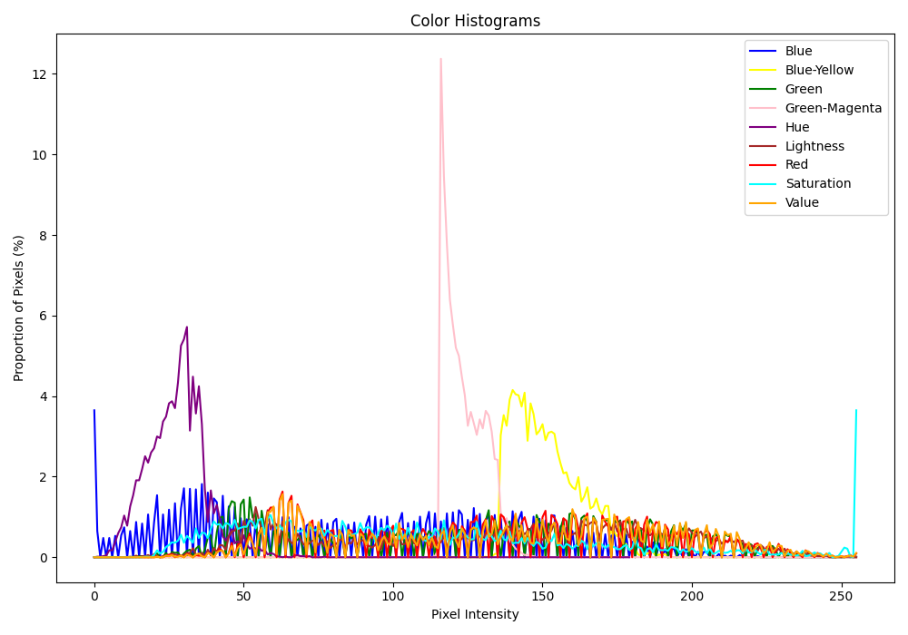
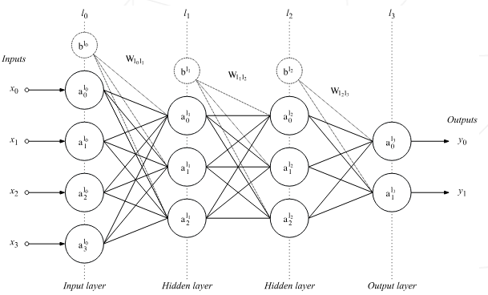
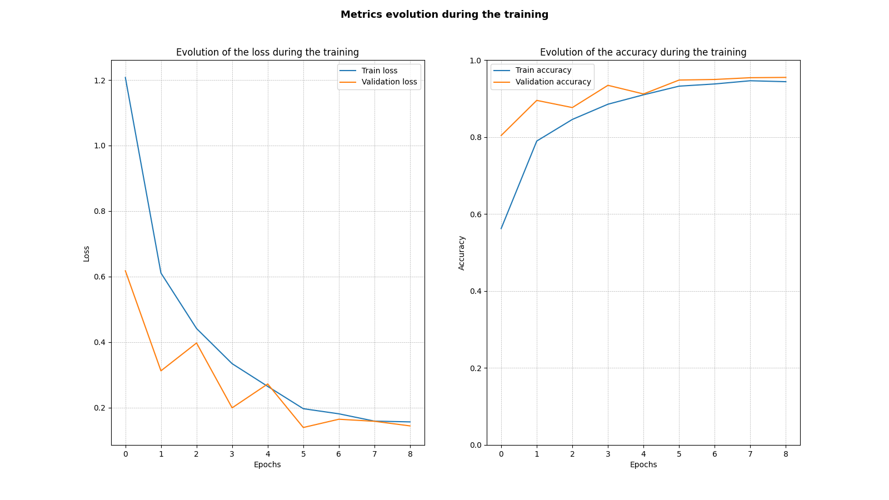
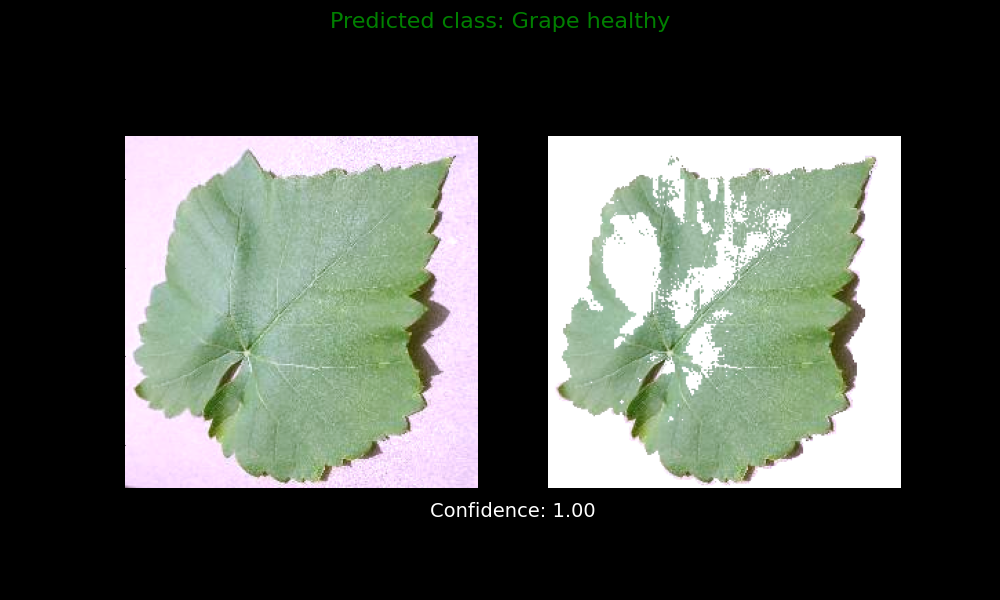

<h1 align="center">Leafflection</h1>

<div align="center">

</div>

---

# Computer Vision

## Introduction

Computer vision tasks include methods for acquiring,
processing, analyzing and understanding digital images,
and extraction of high-dimensional data from the real world
to produce numerical or symbolic information,
e.g., in the forms of decisions.

Understanding in this context means the transformation of visual images
(the input of the retina)
into descriptions of the world that make sense to thought processes and can
elicit appropriate action.
This image understanding can be seen as the disentangling of
symbolic information from image data
using models constructed with the aid of geometry,
physics, statistics, and learning theory.

### Computer Vision tasks include:

- **Data Analysis:** Analysis of images and understanding the content.
- **Data Augmentation:** Increase the size of the dataset by applying
  augmentation techniques.
- **Data Transformation:** Transform the data into images that highlight the
  features.
- **Model Building:** Build a model that can classify the images.
- **Model Evaluation:** Evaluate the model's performance on validation dataset.
- **Image Prediction:** Predict the class of the image using the trained model.

-------------------

## Libraries Used

- **[Tensorflow](https://tensorflow.org/guide/):** An open-source machine
  learning framework.
- **[Keras](https://keras.io/):** A high-level neural networks API.
- **[PlantCV](https://plantcv.readthedocs.io/en/stable/):** An open-source
  image analysis software package targeted for plant phenotyping.
- **Numpy:** A library for numerical computing.
- **Matplotlib:** A plotting library for the Python programming language.
- **Pandas:** A data manipulation and analysis library.
- **OpenCv:** A library of programming functions mainly aimed at real-time
  computer vision.

-------------------

## Part 1: Analysis of the Data Set

<div align="center">
  
  
</div>

### Instructions

Write a program named `distribution.py`
that takes as arguments a directory and
fetches images in its subdirectories.
This program, and therefore you, must then extract
and analyze/understand the data
set from the images.
The program should output pie charts and bar
charts for each plant type.
Your program must also retrieve the name of the directory
to name the chart’s colones accordingly.

### Example

```bash
python3 distribution.py --src leaves/
````

The program will walk through the directories and find the root directory.
It will then extract the subdirectory names and the images in them.
To analyze the data set, the program will output pie charts and bar charts
for each plant type.

-------------------

## Part 2: Data augmentation

Looking and the data set, you will notice that the images are not enough to
train a model. The data is not balanced, which could lead to overfitting.
To solve this problem, you will need to augment the data set. This is where
`augmentation.py` comes in. This program takes in a directory and applies
augmentation techniques to the images in the directory.

It automatically
detects the directory with the most images and augments the images in the
other directories to match the number of images in the directory with the most
images. Additionally, you can specify the number of images you want to augment.


<details>
<summary><strong>Click to view images</strong></summary>
<div align="center">
    <div style="display: inline-block; text-align: center; width: 20%;">
        
        <div>Augmented Images created from a single image.</div>
    </div>
</div>
</details>


Above, you can see an example of an image going through different augmentation
techniques. The original image is top and center, and below are the augmented
versions of the image.

```bash
python3 augmentation.py --src leaves/
```

After balancing the data set, we check out the distribution of the data set
again. The data set is now balanced, and we can proceed to the next step.

<div align="center">
  
  
</div>


-------------------

## Part 3: Image Transformation

Next, we want to better understand the images in the data set. To achieve
this, we will transform the images to highlight the features in the images.

<details>
<summary><strong>Click to view images</strong></summary>

<div align="center">
    <div style="display: inline-block; text-align: center; width: 20%;">
        
        <div>Transformed Images created from a single image.</div>
    </div>
</div>
<div align="center">
    <div style="display: inline-block; text-align: center; width: 20%;">
        
        <div>Transformed Image Histogram</div>
    </div>
</div>

</details>

In total, we perform the following transformations:

- [Gaussian Blur](https://www.tutorialspoint.com/opencv/opencv_gaussian_blur.htm):
  A Gaussian blur is the result of blurring an image by a
  Gaussian function.
  It is a widely used effect in graphics software, typically
  to reduce image noise and reduce detail.
- [Disease Mask](https://www.tutorialspoint.com/how-to-mask-an-image-in-opencv-python):
  A mask is a binary image that is used to specify the pixels that
  should be analyzed. In our case we are using a mask to highlight the
  areas of the image that are affected by a disease.
- [ROI Objects](https://medium.com/swlh/roi-segmentation-contour-detection-and-image-thresholding-using-opencv-c0d2ea47b787):
  A region of interest (ROI) is a portion of an image that you want to
  filter or perform some operation on.
- [Analyze Objects](https://www.tutorialspoint.com/opencv/opencv_contour_features.htm):
  Analyzing objects in an image involves detecting the contours of the
  objects and extracting features like area, perimeter, and centroid.
- [Pseudolandmarks](https://www.tutorialspoint.com/opencv/opencv_contour_features.htm):
  Pseudolandmarks are points that are not actual landmarks but are
  used to represent the shape of an object.
  (Top, Center, Bottom)
- [Color Histogram](https://docs.opencv.org/4.x/d1/db7/tutorial_py_histogram_begins.html):
  A color histogram is a representation of the distribution of colors in an
  image.

These images help us understand the data set better and can be used to
improve the model's performance.

-------------------

## Part 4: Classification

### Training the Model

<div align="center">
  
</div>

In this part, we wrote a program named `train.py` that takes as parameter
a directory and fetches images in its subdirectories.
It must then increase/modify those images to learn the characteristics
of the diseases specified in the leaf.
Those learning must be saved and returned in a `.zip` that also includes
your increased/modified images.

Fortunately, we have already a couple programs that augmented and balance
the data set. We can now use the balanced data set to train the model.

```bash
python3 train.py --src leaves/
```

### Tensorflow - Keras Model

The model is a Convolutional Neural Network (CNN) that uses a series of
convolutional and pooling layers followed by fully connected layers for
image classification.

<details>
<summary><strong>Click to view model details</strong></summary>

```bash
Model: "sequential"
┏━━━━━━━━━━━━━━━━━━━━━━━━━━━━━━━━━━━━━━┳━━━━━━━━━━━━━━━━━━━━━━━━━━━━━┳━━━━━━━━━━━━━━━━━┓
┃ Layer (type)                         ┃ Output Shape                ┃         Param # ┃
┡━━━━━━━━━━━━━━━━━━━━━━━━━━━━━━━━━━━━━━╇━━━━━━━━━━━━━━━━━━━━━━━━━━━━━╇━━━━━━━━━━━━━━━━━┩
│ rescaling (Rescaling)                │ (None, 256, 256, 3)         │               0 │
├──────────────────────────────────────┼─────────────────────────────┼─────────────────┤
│ conv2d (Conv2D)                      │ (None, 256, 256, 16)        │             448 │
├──────────────────────────────────────┼─────────────────────────────┼─────────────────┤
│ max_pooling2d (MaxPooling2D)         │ (None, 128, 128, 16)        │               0 │
├──────────────────────────────────────┼─────────────────────────────┼─────────────────┤
│ conv2d_1 (Conv2D)                    │ (None, 128, 128, 32)        │           4,640 │
├──────────────────────────────────────┼─────────────────────────────┼─────────────────┤
│ max_pooling2d_1 (MaxPooling2D)       │ (None, 64, 64, 32)          │               0 │
├──────────────────────────────────────┼─────────────────────────────┼─────────────────┤
│ conv2d_2 (Conv2D)                    │ (None, 64, 64, 64)          │          18,496 │
├──────────────────────────────────────┼─────────────────────────────┼─────────────────┤
│ max_pooling2d_2 (MaxPooling2D)       │ (None, 32, 32, 64)          │               0 │
├──────────────────────────────────────┼─────────────────────────────┼─────────────────┤
│ conv2d_3 (Conv2D)                    │ (None, 32, 32, 128)         │          73,856 │
├──────────────────────────────────────┼─────────────────────────────┼─────────────────┤
│ max_pooling2d_3 (MaxPooling2D)       │ (None, 16, 16, 128)         │               0 │
├──────────────────────────────────────┼─────────────────────────────┼─────────────────┤
│ flatten (Flatten)                    │ (None, 32768)               │               0 │
├──────────────────────────────────────┼─────────────────────────────┼─────────────────┤
│ dense (Dense)                        │ (None, 128)                 │       4,194,432 │
├──────────────────────────────────────┼─────────────────────────────┼─────────────────┤
│ dropout (Dropout)                    │ (None, 128)                 │               0 │
├──────────────────────────────────────┼─────────────────────────────┼─────────────────┤
│ dense_1 (Dense)                      │ (None, 8)                   │           1,032 │
└──────────────────────────────────────┴─────────────────────────────┴─────────────────┘
 Total params: 12,878,714 (49.13 MB)
 Trainable params: 4,292,904 (16.38 MB)
 Non-trainable params: 0 (0.00 B)
 Optimizer params: 8,585,810 (32.75 MB)
```

-------------------

### Model Architecture Overview

Each layer of the model is explained in terms of its purpose,
output shape, and the number of parameters (`Param #`) it utilizes.

#### Layer-by-Layer Explanation

#### 1. Rescaling Layer (`rescaling`)

- **Purpose**: Normalize pixel values of input images to the range [0, 1].
    - **Output Shape**: `(None, 256, 256, 3)`
    - **Param #**: `0`
        - No trainable parameters; it's a preprocessing step.

#### 2. Convolutional Layer (`conv2d`)

- **Purpose**: Apply convolution operation with 16 filters.
    - **Output Shape**: `(None, 256, 256, 16)`
    - **Param #**: `448`
        - **Explanation**:
            - **Convolution**: This layer convolves (slides) 16 filters (small
              matrices) across the input image to produce 16 feature maps.
            - **Kernel Size**: The size of each filter matrix is `3x3`
              pixels (`kernel_size=3`), which determines the local input region
              to
              which each filter is applied.
            - **Activation Function (ReLU)**: Applies the ReLU (Rectified
              Linear
              Unit) activation function element-wise to introduce
              non-linearity.

#### 3. MaxPooling2D Layer (`max_pooling2d`)

- **Purpose**: Downsample representation by extracting maximum values.
    - **Output Shape**: `(None, 128, 128, 16)`
    - **Param #**: `0`
        - **Explanation**:
            - **Max Pooling**: Reduces the dimensionality of each feature map,
              retaining the most important information.
            - **Pool Size**: Defaults to a `2x2` window (`pool_size=(2, 2)`),
              halving the spatial dimensions (width and height).

#### 4. Convolutional Layer (`conv2d_1`)

- **Purpose**: Apply convolution operation with 32 filters.
    - **Output Shape**: `(None, 128, 128, 32)`
    - **Param #**: `4,640`
        - **Explanation**:
            - Builds upon the previous convolutional layer, extracting 32
              different
              features.

#### 5. MaxPooling2D Layer (`max_pooling2d_1`)

- **Purpose**: Downsample representation.
    - **Output Shape**: `(None, 61, 61, 32)`
    - **Param #**: `0`

#### 6. Dropout Layer (`dropout`)

- **Purpose**: Regularization to prevent overfitting by randomly setting a
  fraction of input units to zero.
    - **Output Shape**: `(None, 64, 64, 32)`
    - **Param #**: `0`

#### 7. Convolutional Layer (`conv2d_2`)

- **Purpose**: Apply convolution operation with 64 filters.
    - **Output Shape**: `(None, 64, 64, 64)`
    - **Param #**: `18,496`

#### 8. MaxPooling2D Layer (`max_pooling2d_2`)

- **Purpose**: Further downsample representation.
    - **Output Shape**: `(None, 32, 32, 64)`
    - **Param #**: `0`

#### 9. Convolutional Layer (`conv2d_3`)

- **Purpose**: Apply convolution operation with 128 filters.
    - **Output Shape**: `(None, 32, 32, 128)`
    - **Param #**: `73,856`

#### 10. MaxPooling2D Layer (`max_pooling2d_3`)

- **Purpose**: Further downsample representation.
    - **Output Shape**: `(None, 16, 16, 128)`
    - **Param #**: `0`

#### 11. Flatten Layer (`flatten`)

- **Purpose**: Convert 2D matrix into a vector.
    - **Output Shape**: `(None, 32,768)`
    - **Param #**: `0`

#### 12. Dense Layer (`dense`)

- **Purpose**: Fully connected layer with 128 neurons.
    - **Output Shape**: `(None, 128)`
    - **Param #**: `4,194,432`

#### 13. Dropout Layer (`dropout`)

- **Purpose**: Regularization to prevent overfitting.
    - **Output Shape**: `(None, 128)`
    - **Param #**: `0

#### 14. Dense Layer (`dense_1`)

- **Purpose**: Output layer with 8 neurons (equal to the number of classes).
    - **Output Shape**: `(None, 8)`
    - **Param #**: `1,032`

#### Total Parameters

- **Total params**: `12,878,714` (49.13 MB)
    - Total number of parameters in the model.
      These include weights, biases, and other learnable parameters
      such as Adam optimizer parameters.
    - **Trainable params**: `4,292,904` (16.38 MB)
        - Number of parameters that can be updated during training.
    - **Non-trainable params**: `0` (0.00 B
        - Number of parameters that are not updated during training.
          These include the parameters of the Rescaling layer.
    - **Optimizer params**: `8,585,810` (32.75 MB
        - Additional parameters used by the optimizer (Adam).

</details>

-------------------

### Summary

This CNN model uses a series of convolutional and pooling layers followed by
fully connected layers for image classification. Here's a breakdown of key
terms:

- **Convolutional Layer**: Applies filters to input images to extract features
  like edges and textures.
- **Max Pooling**: Reduces the spatial dimensions of each feature map, focusing
  on the most important features.
- **Kernel Size**: Specifies the size of the filter matrix used in
  convolutional layers.
- **Dropout**: Randomly drops a fraction of connections between layers during
  training to prevent overfitting.
- **Activation Function (ReLU)**: Introduces non-linearity to the model,
  allowing it to learn complex patterns in the data.

Understanding these components helps in designing effective neural networks for
tasks like image classification, improving both model accuracy and efficiency.

-------------------

### Training Results

<div align="center">
  
</div>

The model was trained for 10 epochs with a batch size of 32. The training
accuracy was 95%, and the validation accuracy was 96%. The training loss was
0.15, and the validation loss was 0.13.

### Model Evaluation

After training the model, we evaluate its performance on the test data set.
The model achieves an accuracy of 96% on the test data set, indicating that it
generalizes well to unseen data.

### Saving the Model

Once the model is trained and evaluated, it is saved as a `.zip` file along
with the split data set and augmented images. We save the validation data set
separately from the training data set to evaluate the model's performance.
Additionally, we save the labels and model architecture for future reference.

-------------------

## Part 5: Image Prediction

### Predicting the Class of an Image

Finally, we wrote a program named `predict.py` that takes as parameter an image
or a directory of images and predicts the class of the image using the trained
model.

```bash
python3 predict.py --src data/validation/Grape_healthy/image_(1).jpg
```

The program extracts the model and labels from the `.zip` file and uses them to
predict the class of the image. It then displays the image along with the
predicted class and the model's confidence in the prediction.

<div align="center">
  
</div>

The model predicts the class of the image as `Grape_healthy` with a confidence
of 99.9%. Not too shabby!


